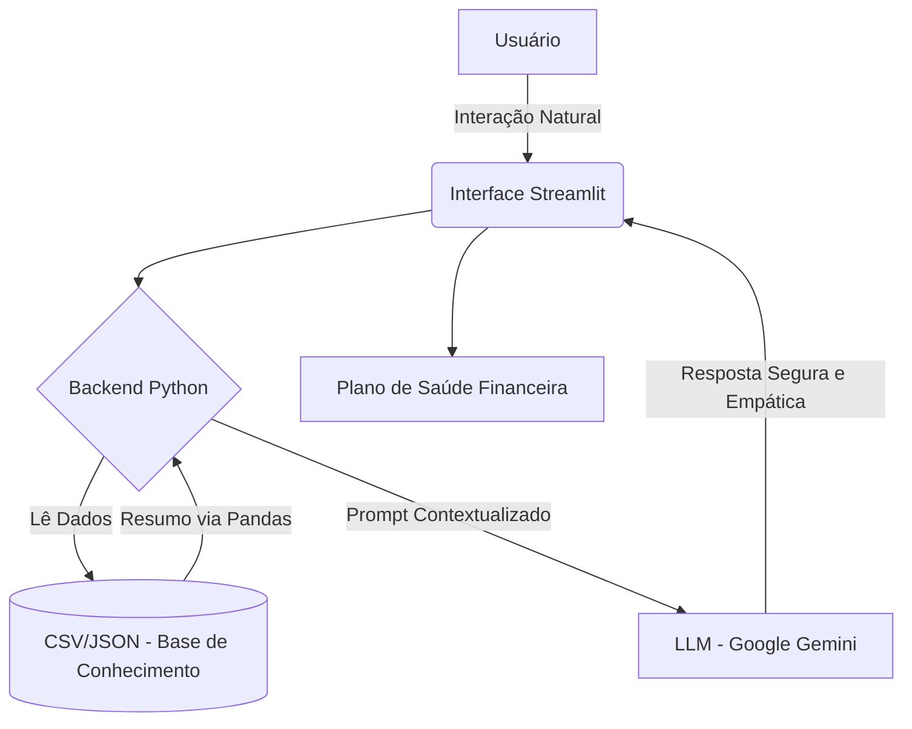

# AnyaFinanças 💜 | Agente Inteligente de Saúde Financeira

> **Projeto desenvolvido para o Bootcamp Bradesco - GenAI & Dados na DIO.**
> 
> A **AnyaFinanças** não é apenas um chatbot; é uma Analista de Saúde Financeira que utiliza Inteligência Artificial Generativa para transformar a relação de jovens e clientes de varejo com suas dívidas, focando especialmente na erradicação do uso predatório do crédito rotativo.

---

## 🚀 Visão Geral

No cenário bancário atual, o endividamento por falta de educação financeira é um desafio crítico. A Anya resolve isso através de:
- **Análise Preditiva de Gastos:** Identifica gargalos (como excesso de delivery) antes do fechamento da fatura.
- **Consultoria de Crédito Saudável:** Sugere a troca de dívidas de juros altos (rotativo) por opções mais baratas do catálogo do banco.
- **Persona Empática:** Comunicação acessível e acolhedora, garantindo uma experiência de usuário (UX) superior e humanizada.

---

## 🛠️ Stack Tecnológica

- **Linguagem:** [Python](https://www.python.org/)
- **Interface:** [Streamlit](https://streamlit.io/)
- **Processamento de Dados:** [Pandas](https://pandas.pydata.org/)
- **Cérebro (LLM):** [Google Gemini AI](https://ai.google.dev/)
- **Arquitetura:** RAG (Retrieval-Augmented Generation) simplificado para evitar alucinações.

---

## 🏗️ Arquitetura do Projeto

A Anya utiliza uma técnica de injeção de contexto dinâmico. O sistema lê dados locais de transações, gera um resumo estatístico e injeta esse conhecimento no prompt do LLM junto com as diretrizes de segurança e personalidade.

📁 Estrutura do Repositório

📁 data/                # Bases de conhecimento (Transações, Produtos, Histórico)
📁 docs/                # Documentação detalhada em 5 etapas (Metodologia DIO)
📁 src/                 # Código-fonte da aplicação (app.py)
📄 requirements.txt     # Dependências do projeto
📄 README.md            # Guia principal do projeto

⚙️ Como Executar
1. Clone o repositório:
    git clone https://github.com/EndryusSchmidel/Anya-finances.git

2. Instale as dependências:
    code
    Bash
    pip install -r requirements.txt

3. Obtenha uma API Key:
Gere sua chave gratuita no Google AI Studio.

4. Inicie a Anya:
streamlit run src/app.py

📊 Avaliação e Resultados
O agente foi submetido a testes de Compliance e Grounding, apresentando:
* 100% de Assertividade em cálculos baseados nos arquivos CSV.
* Zero Alucinações em produtos financeiros fora do catálogo JSON.
* Alta taxa de engajamento devido ao tom de voz empático e didático.

🎥 Demonstração e Pitch
Confira a Anya em ação e a explicação técnica completa da solução no link abaixo:
[🔗 Assista ao Pitch da AnyaFinanças no Google Drive](https://www.google.com/url?sa=E&q=https%3A%2F%2Fdrive.google.com%2Ffile%2Fd%2F1kltR8-a222uEk7_iFY8h1TtSLcyiMVJv%2Fview%3Fusp%3Dsharing)

## 👨‍💻 Autor e Contato

**Endryus Schmidel** - *Software Engineer Intern / ADS Student*

  
  

